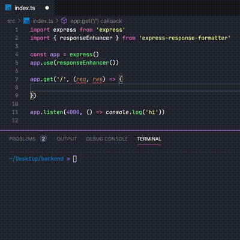

# express-response-formatter

[](https://github.com/aofleejay/express-response-formatter/blob/master/LICENSE.md) [](https://www.npmjs.com/package/express-response-formatter) [](https://github.com/prettier/prettier) [](http://makeapullrequest.com) [](https://travis-ci.org/aofleejay/express-response-formatter) [](https://coveralls.io/github/aofleejay/express-response-formatter?branch=master)

Better way to format Express response

## How It Works

- You can use response with readable name like `res.formatter.ok` for 200 ok or `res.formatter.badRequest` for 400 bad request.
- It will format your response in two ways `success` and `error`.
  - If response is `2xx, 3xx` return response under object key `data`.
  - If response is `4xx, 5xx` return response under object key `error`.
- You can pass metadata as second parameter and it's will present under `meta` object key.



## Installation

```
npm install express-response-formatter --save
```

## Quick Start

Response for 200 Ok.

```js
import app from 'express'
import { responseEnhancer } from 'express-response-formatter'

const app = express()

// Add formatter functions to "res" object via "responseEnhancer()"
app.use(responseEnhancer())

app.get('/success', (req, res) => {
  const users = [{ name: 'Dana Kennedy' }, { name: 'Warren Young' }]

  // It's enhance "res" with "formatter" which contain formatter functions
  res.formatter.ok(users)
})

app.listen(3000, () => console.log('Start at http://localhost:3000'))
```

Result

```json
HTTP/1.1 200 Ok
{
  "data": [
    {
      "name": "Dana Kennedy"
    },
    {
      "name": "Warren Young"
    }
  ]
}
```

## More usages

Response for 200 Ok with `meta field`

```js
app.get('/success-with-meta', (req, res) => {
  const users = [{ name: 'Dana Kennedy' }, { name: 'Warren Young' }]

  const meta = {
    total: 2,
    limit: 10,
    offset: 0,
  }

  res.formatter.ok(users, meta)
})
```

```json
HTTP/1.1 200 Ok
{
  "meta": {
    "total": 2,
    "limit": 10,
    "offset": 0,
  },
  "data": [
    {
      "name": "Dana Kennedy"
    },
    {
      "name": "Warren Young"
    }
  ]
}
```

Response for 400 Bad Request with "error"

```js
app.get('/bad-request', (req, res) => {
  const errors = [
    { detail: 'Field id is required.' },
    { detail: 'Field foo is required.' },
  ]

  res.formatter.badRequest(errors)
})
```

```json
HTTP/1.1 400 Bad Request
{
  "error": [
    {
      "detail": "Field id is required."
    },
    {
      "detail": "Field foo is required."
    }
  ]
}
```

## APIs

| METHOD                                         | STATUS CODE |
| ---------------------------------------------- | ----------- |
| res.formatter.ok(data, meta?)                  | 200         |
| res.formatter.created(data, meta?)             | 201         |
| res.formatter.accepted(data, meta?)            | 202         |
| res.formatter.noContent(data, meta?)           | 204         |
| res.formatter.badRequest(errors, meta)         | 400         |
| res.formatter.unauthorized(errors, meta)       | 401         |
| res.formatter.forbidden(errors, meta)          | 403         |
| res.formatter.notFound(errors, meta)           | 404         |
| res.formatter.methodNotAllowed(errors, meta)   | 405         |
| res.formatter.timeout(errors, meta)            | 408         |
| res.formatter.conflict(errors, meta)           | 409         |
| res.formatter.unprocess(errors, meta)          | 422         |
| res.formatter.tooManyRequests(errors, meta)    | 429         |
| res.formatter.serverError(errors, meta)        | 500         |
| res.formatter.badGateway(errors, meta)         | 502         |
| res.formatter.serviceUnavailable(errors, meta) | 503         |
| res.formatter.gatewayTimeout(errors, meta)     | 504         |
